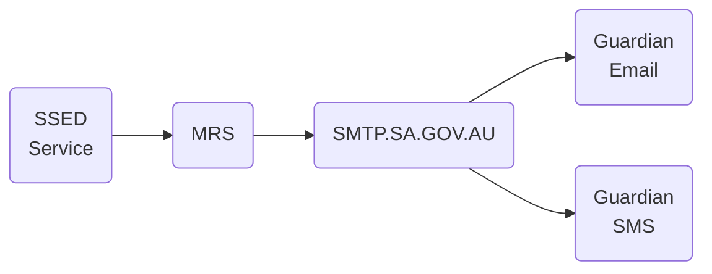
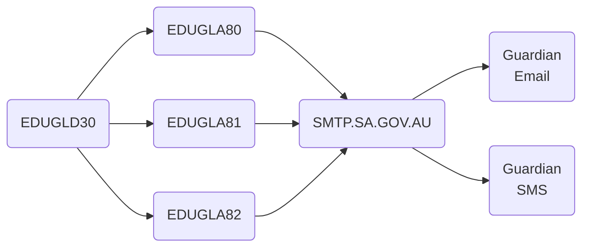
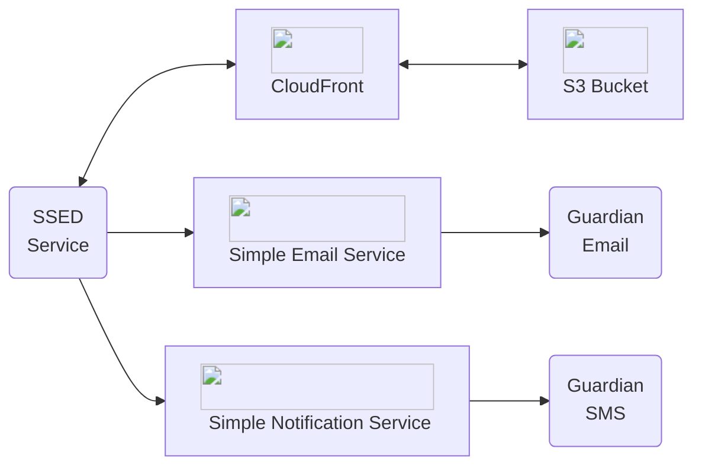

# SSED Communication Modernisation
### Overview

The SSED application supports school administrative staff in managing the transition of students from primary to secondary education.

The Applications team would like to re-architect the email/SMS pipeline to enhance system efficiency, thereby reducing confusion among school staff and decreasing the volume of ICT incident requests.

Our cloud architecture prioritizes stateless, scalable microservices for robust performance and affordability.

### Success Criteria
#### Essential
<ul> 
<li>No longer rely on MRS[^1] for email and SMS service</li>
<li>Timely delivery of emails</li>
<ul></li>
<li>100 emails per second</li>
</ul>
<li>Cost effective</li>
<ul></li>
<li>Under five cents per SMS </li>
<li>Under twenty cents per one thousand emails</li>
</ul>
</ul>

#### Desirable
<ul>
<li>Deliver attachments via weblinks
</li>
</ul>

#### Assumptions
<ul>
<li>School uploaded files
<ul></li>
<li>Need to be accessible for longer than seven days</li>
</li>
<li>Accessible for up to one month</li>
<li>Deleted after three months</li>
</ul>
<li>MRS and or StateNet SMTP relay are creating a bottleneck
<li>SSED can integrate with AWS SDKs</li>
</ul>

### Considerations

 Digital Architecture have investigated numerous message delivery systems and found that AWS SES and SNS services provide the most value while fitting the business requirements.

#### Email Communication
<table>
<thead>
<tr>
<th>
</th>
<th>Azure Communication Services</th>
<th>AWS Simple Email Service</th>
</tr>
</thead>
<tbody>
<tr>
<td>Price per Email</td>
<td>$0.00025</td>
<td>$0.00010</td>
</tr>
<tr>
<td>Price per MB</td>
<td>$0.00012</td>
<td>$0.00012</td>
</tr>
</tbody>
</table>

#### SMS Communication
<table>
<thead>
<tr>
<th>
</th>
<th>Azure Communication Services</th>
<th>AWS Simple Notification Service</th>
</tr>
</thead>
<tbody>
<tr>
<td>Price per SMS</td>
<td>$0.0490</td>
<td>$0.0345</td>
</tr>
<tr>
<td>Set up time[^2]</td>
<td>4-5 weeks</tc>
<td>24 hours</td>
<td></td>
<tr>
<td>Delivery Rates</td>
<td>600 messages per minute</tc>
<td>1200 messages per minute</td>
<td></td>
</tr>
</table>

### SSED Notification Workflow

#### Existing Workflow

The Three Webservers host the SSED application and the MRS service.
The Database Server stores pdf files that are uploaded from schools.

#### Proposed Solution

The Three Webservers host the SSED application and send communication directly via Amazon Web Services. Attachments are stored in an S3 bucket behind CloudFront with CloudFront Signed URLs, these are valid for a one month. An S3 Lifecycle policy will delete files after three months.

#### Requirements
<ul>
<li>Domain or subdomain to send emails
</li>
<li>Sender ID for SMS messaging</li>
</ul>

#### Developer Guide

<a href="https://docs.aws.amazon.com/ses/latest/dg/send-email-concepts-email-format.html"title="Email Format">Email Format</a>

<a href="https://docs.aws.amazon.com/ses/latest/dg/tips-and-best-practices.html"title="Email Best Practices">Email Best Practices</a>

<a href="https://docs.aws.amazon.com/sns/latest/dg/channels-sms-best-practices.html#channels-sms-best-practices-appropriate-content" title="SMS Best Practices">SMS Best Practices</a>

<a href="https://docs.aws.amazon.com/AmazonS3/latest/userguide/upload-objects.html" title="S3 Bucket Upload">S3 Bucket Upload</a>

<a href="https://docs.aws.amazon.com/AmazonCloudFront/latest/DeveloperGuide/private-content-signed-urls.html" title="Cloudfront Signed URLs">CloudFront Signed URLs</a>

[^1] Applications SMTP relay that authenticates and forwards to SMTP.SA.GOV.AU
[^2] Service provider allocated time from moving from the sandbox environment to production.

